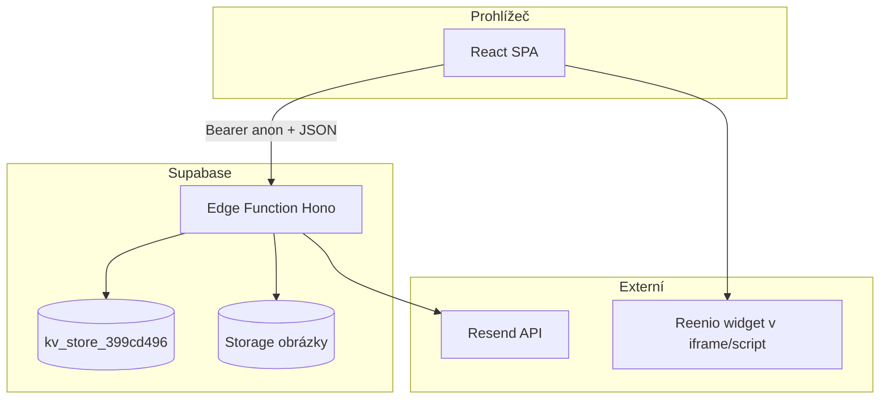

# Mapa projektu — Farma pod Janovou horou (web + CMS)

Dokument popisuje strukturu repozitáře, vzhled, tok dat, Supabase, externí služby a nasazení. Aktualizováno podle stavu kódu v projektu.

---

## Obsah

1. [Přehled technologií](#1-přehled-technologií)
2. [Struktura adresářů](#2-struktura-adresářů)
3. [Vzhled a design systém](#3-vzhled-a-design-systém)
4. [Routing a veřejné stránky](#4-routing-a-veřejné-stránky)
5. [Mapování URL → pageId (preload)](#5-mapování-url--pageid-preload)
6. [CMS a administrace](#6-cms-a-administrace)
7. [Supabase — databáze, Storage, Edge Function](#7-supabase--databáze-storage-edge-function)
8. [HTTP API (Hono)](#8-http-api-hono)
9. [Frontend API klient](#9-frontend-api-klient)
10. [Rezervace (Reenio)](#10-rezervace-reenio)
11. [Kontaktní formulář a e-mail](#11-kontaktní-formulář-a-e-mail)
12. [SEO a prerender](#12-seo-a-prerender)
13. [Build, GitHub Pages a proměnné prostředí](#13-build-github-pages-a-proměnné-prostředí)
14. [Důležité poznámky a omezení](#14-důležité-poznámky-a-omezení)

---

## 1. Přehled technologií

| Vrstva | Technologie |
|--------|-------------|
| UI | React 18, React Router 7, Vite 6, Tailwind CSS 4 |
| Komponenty | Radix UI (`src/app/components/ui/`), vlastní komponenty (např. `Button`, `FloatingCard`, `Navigation`) |
| Backend (API) | Supabase Edge Function — framework **Hono** v `supabase/functions/server/index.tsx` |
| Vstupní bod funkce | `supabase/functions/make-server-399cd496/index.ts` (import serveru) |
| Perzistentní data | PostgreSQL tabulka **`kv_store_399cd496`** (key–value) přes `kv_store.tsx` |
| Soubory (obrázky CMS) | Supabase Storage bucket **`make-399cd496-images`** (privátní, signed URL) |
| Odesílání e-mailů | **Resend** (`RESEND_API_KEY`, volitelně `CONTACT_FORM_FROM_EMAIL`) |
| Statické nasazení | **GitHub Actions** → **GitHub Pages** (`.github/workflows/deploy-pages.yml`) |
| Prerender | Playwright Chromium (`scripts/prerender.mjs`) |

**Poznámka:** V kódu není integrace **BooqMe**. Rezervace jsou řešené vložením **Reenio** (widget / iframe / odkaz) na stránce kontaktu.

---

## 2. Struktura adresářů

```
FPJH/
├── .github/workflows/deploy-pages.yml   # CI: build + prerender + deploy na Pages
├── scripts/prerender.mjs                # Statické HTML pro veřejné routy
├── src/
│   ├── main.tsx                         # Vstup React
│   ├── styles/                          # theme.css, tailwind.css, fonts.css, index.css
│   └── app/
│       ├── App.tsx                      # RouterProvider, AdminProvider, normalizace textu (DEV)
│       ├── routes.ts                    # Definice rout
│       ├── contexts/AdminContext.tsx    # Session CMS (localStorage)
│       ├── components/                  # Veřejné + ui/ + admin/ + RouteSeo, Footer, …
│       ├── hooks/                       # usePageData, useGlobalSettings, useContactData, …
│       ├── pages/                       # Veřejné stránky + admin/ + CMSLogin
│       └── utils/                       # api.ts, siteDataCache, preloadRouteData, cmsInternalLinks, …
├── supabase/functions/
│   ├── make-server-399cd496/index.ts    # Entry Edge Function
│   └── server/
│       ├── index.tsx                    # Hono app, routy, Resend, Storage
│       ├── kv_store.tsx                 # CRUD nad kv_store_399cd496
│       ├── seed.tsx                     # Seed výchozího obsahu
│       └── defaultContent.ts            # Výchozí obsah (související se seed)
├── utils/supabase/info.tsx              # projectId, publicAnonKey (frontend)
├── vite.config.ts
└── package.json
```

---

## 3. Vzhled a design systém

| Co | Kde |
|----|-----|
| Design tokeny (barvy, stíny, sémantika) | `src/styles/theme.css` — zelená/hnědá/zlato z loga, `--farm-primary`, `--farm-page-bg`, text, border |
| Fonty | `@fontsource/plus-jakarta-sans`, `@fontsource/lora` v `src/styles/index.css`; úpravy v `fonts.css` |
| Tailwind | `src/styles/tailwind.css`, Vite plugin `@tailwindcss/vite` |
| Veřejný layout | `src/app/pages/Root.tsx` — po načtení dat `Navigation`, `<main><Outlet /></main>`, `Footer`, `CookieConsent`; při čekání `SiteLoadingScreen` |
| Konvence admin UI | `src/imports/cms-admin-design.md` |

Globální **logo**, **výchozí hero** a **favicon** jdou z CMS (`GlobalSettings` + `useGlobalSettings`). Barvy a typografie veřejného webu jsou primárně v **CSS** (`theme.css`), ne přes stará „design“ pole v DB.

---

## 4. Routing a veřejné stránky

Definice: **`src/app/routes.ts`**. `basename` = `import.meta.env.BASE_URL` (důležité pro nasazení pod cestu, např. GitHub Pages).

| Cesta | Komponenta |
|-------|------------|
| `/` | `Home` |
| `/sluzby` | `Services` |
| `/blog` | `Blog` |
| `/nasi-kone` | `Horses` |
| `/o-nas` | `About` |
| `/kontakt` | `Contact` |
| `/ochrana-osobnich-udaju` | `PrivacyPolicy` |
| `/cookies` | `CookiesPolicy` |
| `/obchodni-podminky` | `TermsConditions` |
| `/reklamacni-rad` | `ComplaintsPolicy` |
| `/cms-prihlaseni` | `CMSLogin` |
| `*` (pod `/`) | `NotFound` |
| `/admin` | `AdminLayout` → výchozí `PageEditor` |
| `/admin/settings` | `GlobalSettings` |

Admin větev **není** ve veřejném seznamu prerenderu (jen statické stránky webu).

---

## 5. Mapování URL → pageId (preload)

**Soubor:** `src/app/utils/preloadRouteData.ts`

Před vykreslením stránky se pro danou cestu paralelně načtou globální nastavení a obsah příslušných stránek z API (cache v `siteDataCache.ts`).

| Pathname (prefix) | Načítané `pageId` |
|-------------------|-------------------|
| `/` | `domu`, `sluzby`, `nasi-kone`, `kontakt` |
| `/sluzby` | `sluzby`, `kontakt` |
| `/blog` | `blog`, `kontakt` |
| `/nasi-kone` | `nasi-kone`, `kontakt` |
| `/o-nas` | `o-nas`, `kontakt` |
| `/kontakt` | `kontakt` |
| právní stránky | příslušný id + `kontakt` |
| `/cms-prihlaseni` | `kontakt` |
| ostatní | výchozí aspoň `kontakt` |

**ID stránek v CMS** (`PageEditor.tsx`): `domu`, `sluzby`, `blog`, `nasi-kone`, `o-nas`, `kontakt`, `ochrana`, `cookies`, `podminky`, `reklamace`, `404`.

---

## 6. CMS a administrace

| Prvek | Implementace |
|-------|----------------|
| Přihlášení | `CMSLogin.tsx` + `AdminContext.tsx` |
| Session | `localStorage` (`adminAuth`, `adminLastActivity`), timeout nečinnosti 30 min |
| Layout adminu | `AdminLayout.tsx` — redirect na login, SEO metadata pro admin, odkazy na web a nastavení |
| Výběr a editace stránek | `PageEditor.tsx` — query `?page=`, načtení/uložení přes `pagesApi` |
| Editory obsahu | `editors/HomePageEditor.tsx`, `ServicesPageEditor.tsx`, `OtherPageEditors.tsx` (blog, koně, o nás, kontakt, právní, 404) |
| Globální nastavení | `GlobalSettings.tsx` — obecné údaje, design (logo, hero, favicon), změna hesla (volá API) |
| Upload obrázků | `components/admin/ImageUpload.tsx` → Edge Function `upload-image` |
| Seed dat | `pages/admin/SeedData.tsx` → `POST .../seed` |

**Hooky:** `usePageData`, `usePageContent`, `useGlobalSettings`, `useContactData` — kombinace cache a API podle kontextu.

**Autentizace:** V `AdminContext` je přihlášení aktuálně **hardcoded** (`admin` / `admin`). Endpoint `change-password` ukládá heslo do KV pod `admin:password`, ale **přihlášení do CMS tento údaj nepoužívá** — viz sekce 14.

---

## 7. Supabase — databáze, Storage, Edge Function

### 7.1 Edge Function a klient

- Veřejná URL: `https://{projectId}.supabase.co/functions/v1/make-server-399cd496/...`
- `projectId` a `publicAnonKey` jsou v `utils/supabase/info.tsx` (build-time konfigurace).
- Požadavky z prohlížeče: hlavička `Authorization: Bearer {publicAnonKey}`.

### 7.2 Databáze (KV)

- Modul: `supabase/functions/server/kv_store.tsx`
- Tabulka: **`kv_store_399cd496`** — sloupce typicky `key`, `value` (JSON)
- Typické klíče:
  - `page:{pageId}` — JSON obsahu stránky pro CMS
  - `global:settings` — globální nastavení webu
  - `admin:password` — heslo pro endpoint změny hesla (viz poznámka o loginu)

### 7.3 Storage

- Bucket: **`make-399cd496-images`**
- Vytvoření bucketu při startu serveru (pokud neexistuje), privátní, limit velikosti a MIME typy v `index.tsx`
- Upload přes Edge Function → **signed URL** (dlouhá platnost) vrácená klientovi

### 7.4 Prostředí na serveru (Deno)

Edge Function používá mimo jiné:

- `SUPABASE_URL`, `SUPABASE_SERVICE_ROLE_KEY` — klient pro Storage a DB
- `RESEND_API_KEY`, `CONTACT_FORM_FROM_EMAIL` — kontaktní formulář

---

## 8. HTTP API (Hono)

**Základní prefix cest:** `/make-server-399cd496`

| Metoda | Cesta | Účel |
|--------|--------|------|
| GET | `/health` | Kontrola provozuschopnosti |
| GET | `/pages` | Seznam stránek (metadata z KV prefix `page:`) |
| GET | `/pages/:pageId` | Obsah jedné stránky (`page:{pageId}`) |
| PUT | `/pages/:pageId` | Uložení obsahu stránky |
| GET | `/settings` | `global:settings` |
| POST | `/settings` | Uložení `global:settings` (tělo `{ settings }`) |
| POST | `/upload-image` | multipart, upload do Storage + signed URL |
| DELETE | `/images/:filename` | Smazání souboru v bucketu |
| POST | `/contact-message` | Odeslání zprávy přes Resend |
| POST | `/change-password` | Ověření starého hesla vůči `admin:password`, uložení nového |
| POST | `/seed` | Naplnění výchozího obsahu |

CORS v serveru je nastaveno široce (`origin: *`) pro volání z frontendu.

---

## 9. Frontend API klient

**Soubor:** `src/app/utils/api.ts`

- `API_BASE_URL` = `https://${projectId}.supabase.co/functions/v1/make-server-399cd496`
- `pagesApi.getAll()`, `get(id)`, `save(id, data)`
- `settingsApi.get()`, `save(settings)`
- `contactApi.sendMessage({ name, email, phone?, message })`
- Odpovědi procházejí `fixMojibakeDeep` (`encoding.ts`) kvůli kódování textů.

**Cache:** `siteDataCache.ts` — `preloadPage`, `preloadSettings`, invalidace po uložení kde je potřeba.

---

## 10. Rezervace (Reenio)

| Krok | Kde |
|------|-----|
| Konfigurace v CMS | `OtherPageEditors.tsx` — u záložek kontaktu typu „embed“ pole **Reenio URL / iframe / widget snippet** (`reenioUrl`) |
| Parsování vstupu | `src/app/utils/contactPageConfig.ts` — `parseReenioEmbedConfig()`, režimy `widget`, `iframe`, `link`, `none` |
| Vykreslení na webu | `src/app/pages/Contact.tsx` — vložení widgetu (div + script), iframe, nebo odkaz |

Žádné server-side volání Reenio API — jen embed třetí strany v prohlížeči.

---

## 11. Kontaktní formulář a e-mail

1. Uživatel odešle formulář na `/kontakt`.
2. Frontend zavolá `contactApi.sendMessage`.
3. Edge Function načte příjemce z obsahu `page:kontakt` nebo z `global:settings` (`normalizeContactRecipient` v `index.tsx`).
4. E-mail odešle **Resend** (HTML + text).

---

## 12. SEO a prerender

| Co | Kde |
|----|-----|
| Dynamická metadata na klientovi | `RouteSeo.tsx` + data z `useGlobalSettings` (volitelná pole, fallbacky v kódu) |
| Načítání při přechodu | `Root.tsx` + `preloadRouteData` + `dataset.routeReady` pro synchronizaci s prerenderem |
| Statické HTML | `scripts/prerender.mjs` — routy: `/`, `/sluzby`, `/blog`, `/nasi-kone`, `/o-nas`, `/kontakt`, právní stránky; čeká `document.body.dataset.routeReady === 'true'` |
| SPA fallback na Pages | Po buildu se kopíruje `dist/index.html` → `dist/404.html` (workflow) |

---

## 13. Build, GitHub Pages a proměnné prostředí

### Lokálně / CI build

- `npm run build` — Vite → `dist/`
- `npm run prerender` — vyžaduje zkompilovaný `dist`, spustí preview server a Playwright

### GitHub Actions (`deploy-pages.yml`)

- Trigger: push na `main`, nebo ručně `workflow_dispatch`
- Env: `VITE_BASE_PATH` (typicky `/název-repa/`), `VITE_SITE_URL` (canonical URL Pages)
- Kroky: `npm ci` → `npm run build` → `npx playwright install` → `npm run prerender` → `404.html` → upload artifact → `deploy-pages`

### Vite

- `vite.config.ts`: `base` z `process.env.VITE_BASE_PATH || '/'`

---

## 14. Důležité poznámky a omezení

1. **Přihlášení CMS vs. změna hesla:** Přihlášení v `AdminContext` kontroluje pevné `admin`/`admin`. Endpoint `change-password` pracuje s `admin:password` v KV — po změně hesla v nastavení se **přihlašovací formulář chování nemění**, dokud se logika nesjednotí (např. ověření proti API nebo uložení stejného zdroje pravdy).
2. **Reenio ≠ BooqMe:** Projekt nepoužívá BooqMe; rezervace jsou přes Reenio embed.
3. **Veřejný anon klíč** je v bundlu frontendu — typické pro Supabase; citlivé operace jsou na serveru se service role.
4. **Migrace / výchozí data:** nástroje jako `migrateStaticDataToCMS.ts`, `quickMigrate.ts` (DEV) — doplňkové skripty, ne hlavní runtime tok.

---

## Rychlý diagram architektury



---

*Tento soubor slouží jako orientační mapa kódu; při větších změnách architektury ho aktualizujte.*
